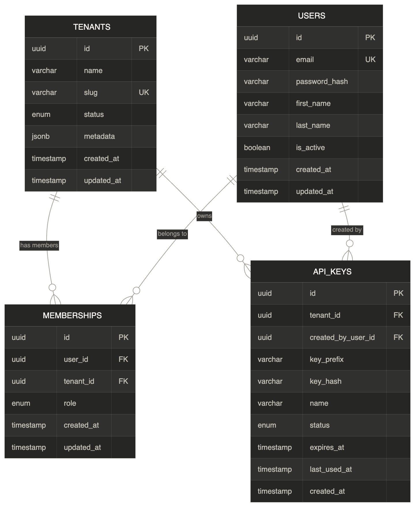

# Architecture Overview

## Philosophy

Meterplex follows the **modular monolith** pattern - a single deployable NestJS application with strict module boundaries enforced by the framework's dependency injection system.

### Why not microservices?

Microservices on day one create a **distributed monolith** - the worst of both worlds. You get the operational complexity of multiple services (separate deployments, inter-service communication, distributed tracing) without the benefits (independent scaling, isolated failures), because the domain boundaries haven't been proven yet.

The modular monolith gives us:

- **One deployment** - simpler CI/CD, one Docker image, one health check
- **In-process calls** - no network latency between modules, no serialization overhead
- **Shared database** - transactions span modules, no eventual consistency headaches
- **Clean extraction path** - when a module needs independent scaling, extract it. Kafka topics are already in place for async communication

### When to extract a microservice

A module becomes a microservice candidate when:

1. It needs to scale independently (usage ingestion handles 100x more load than billing)
2. It has a different deployment cadence (billing changes weekly, usage is stable)
3. It requires a different runtime (ML scoring in Python, not TypeScript)

Until then, modules stay in the monolith.

## Module Dependency Rules

```text
AppModule
├── ConfigModule (global)     - env validation, ConfigService
├── PrismaModule (global)     - database access
├── HealthModule              - /health endpoint
└── Feature Modules
    ├── TenantsModule          - tenant CRUD
    ├── UsageModule            - usage event ingestion
    ├── BillingModule          - invoice generation
    └── ...
```

**Rules:**

- Feature modules may depend on `ConfigModule` and `PrismaModule` (global)
- Feature modules communicate through **exported services**, not internal imports
- No circular dependencies between feature modules
- If Module A needs data from Module B, Module B exports a service that Module A imports

## Data Flow

```text
Client Request
    │
    ▼
Middleware (correlation ID → request logging)
    │
    ▼
Guards (authentication, authorization)
    │
    ▼
Pipes (validation, transformation)
    │
    ▼
Controller (route handling)
    │
    ▼
Service (business logic)
    │
    ├──▶ PrismaService (database)
    ├──▶ KafkaProducer (async events)
    └──▶ Redis (cache/rate limit)
    │
    ▼
Interceptor (response serialization)
    │
    ▼
Exception Filter (error formatting)
    │
    ▼
Client Response
```

## Infrastructure

| Service | Container | Port | Purpose |
|---------|-----------|------|---------|
| PostgreSQL 17 | meterplex-postgres | 5432 | Primary data store |
| Apache Kafka 3.9 | meterplex-kafka | 9092 | Event streaming |
| Redis 7 | meterplex-redis | 6379 | Cache and rate limiting |

All services run in Docker Compose for local development. In production, these would be managed services (AWS RDS, MSK, ElastiCache or equivalent).

## Phase 1 - Data model



Four tables: `tenants` (organizations), `users` (global accounts), `memberships` (join table with roles), and `api_keys` (server-to-server authentication). A user can belong to multiple tenants with different roles via the memberships table.
