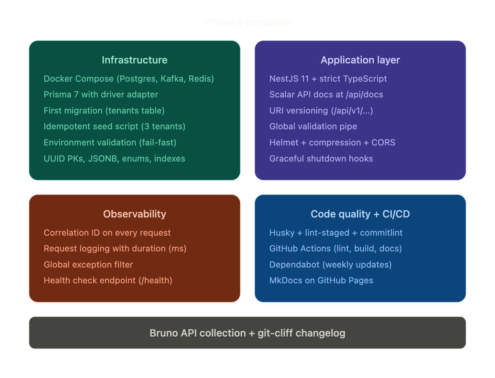

# Phase 0 - Project Setup

**Goal:** Create production-style foundations that every subsequent phase builds on.

**Status:** ✅ Complete

## What Was Built

### Infrastructure

- **Docker Compose** with PostgreSQL 18, Apache Kafka 4.2 (KRaft mode), and Redis 8
- Health checks on all containers (`pg_isready`, `redis-cli ping`, Kafka broker API)
- Named volumes for data persistence across restarts
- Credentials synchronized between Docker Compose and `.env`

### Database

- **Prisma 7** with driver adapter pattern (`@prisma/adapter-pg`)
- `moduleFormat = "cjs"` to resolve ESM/CJS mismatch with NestJS
- First migration: `tenants` table with UUID primary keys, enum status, JSONB metadata, unique slug index
- Idempotent seed script using `upsert` (3 sample tenants)
- Database connection URL configured in `prisma.config.ts` (Prisma 7 requirement - not in `schema.prisma`)

### Application

- **NestJS 11** scaffolded via CLI with `--strict` flag and pnpm
- TypeScript strict mode (`strict: true` - all 10 checks enabled)
- Path aliases: `@common/*`, `@config/*`, `@modules/*`
- Global API prefix `/api` with URI versioning (`/api/v1/...`)
- Health endpoint excluded from prefix and versioning via `VERSION_NEUTRAL`
- Swagger/OpenAPI at `/api/docs` (development only)
- Helmet (security headers), compression (gzip), CORS
- Global validation pipe with whitelist, forbidNonWhitelisted, transform
- Graceful shutdown hooks for clean connection teardown

### Observability

- **Correlation ID middleware** - every request gets a UUID in `x-correlation-id`
- **Request logger middleware** - logs method, path, status, duration for every request
- **Global exception filter** - consistent error JSON with correlationId, timestamp, path
- **Health check endpoint** at `/health` - Postgres connectivity via `SELECT 1`

### Code Quality

- ESLint 9 + Prettier + EditorConfig
- Jest configured with path alias mapping
- `.env.example` documenting every required variable
- `.gitignore` covering secrets, generated code, Docker data, IDE files
- Bruno API collection started

## Key Decisions

| Decision                               | Why                                                                                       |
| :------------------------------------- | :---------------------------------------------------------------------------------------- |
| Modular monolith over microservices    | Domain boundaries unproven. Extract modules when scale demands it                         |
| Prisma over TypeORM                    | Stronger types, better migration tooling, schema-first approach                           |
| pnpm over npm                          | Faster installs, strict dependency resolution, smaller disk usage                         |
| UUID primary keys                      | Safe for distributed systems, no sequential guessing                                      |
| `strict: true` in TypeScript           | Catches null errors, uninitialized properties, unsafe `any` usage at compile time         |
| URI versioning over header versioning  | Visible in URLs, works with Swagger, industry standard (Stripe, GitHub)                   |
| `VERSION_NEUTRAL` on health controller | Load balancers expect `/health` at a fixed path without version prefix                    |
| `moduleFormat = "cjs"` in Prisma       | NestJS compiles to CommonJS; Prisma 7 defaults to ESM. Without this flag, the app crashes |
| Driver adapter pattern (`PrismaPg`)    | Prisma 7 requirement - the client no longer manages its own connection                    |
| `tsx` over `ts-node` for seed          | `ts-node` can't resolve `.js` extension imports in Prisma's generated TypeScript files    |

## Gotchas Encountered

1. **Prisma 7 removed `url` from `schema.prisma`** - connection URL moved to `prisma.config.ts`
2. **Prisma 7 generates ESM by default** - must set `moduleFormat = "cjs"` for NestJS
3. **Prisma 7 requires driver adapters** - can't just `super()` in PrismaService, must pass `PrismaPg` adapter
4. **`@prisma/client` must be installed separately** - `prisma` (CLI) and `@prisma/client` (runtime) are different packages
5. **Local Postgres on port 5432 conflicts with Docker** - stop Homebrew/Postgres.app before running containers
6. **`forRoutes('*')` deprecated in NestJS 11** - use `forRoutes('*path')` for wildcard middleware routing
7. **Health endpoint needs `VERSION_NEUTRAL`** - `exclude` in `setGlobalPrefix` doesn't bypass URI versioning
8. **Prisma 7 seed config moved to `prisma.config.ts`** - no longer in `package.json` under `"prisma": { "seed": ... }`

## Files Created/Modified

```text
meterplex/
├── .editorconfig                          NEW
├── .env                                   MODIFIED (all app env vars)
├── .env.example                           MODIFIED (documented template)
├── .gitignore                             MODIFIED (Prisma generated/, Docker data/)
├── docker-compose.yml                     NEW
├── nest-cli.json                          UNCHANGED (from CLI)
├── package.json                           MODIFIED (scripts, metadata, engines, jest)
├── prisma/
│   ├── migrations/
│   │   └── 20260329_init_tenant/
│   │       └── migration.sql              NEW (auto-generated)
│   ├── schema.prisma                      MODIFIED (Tenant model, moduleFormat)
│   └── seed.ts                            NEW
├── prisma.config.ts                       MODIFIED (seed command added)
├── src/
│   ├── app.module.ts                      MODIFIED (imports Config, Prisma, Health)
│   ├── common/
│   │   ├── filters/
│   │   │   ├── http-exception.filter.ts   NEW
│   │   │   └── index.ts                   NEW
│   │   ├── middleware/
│   │   │   ├── correlation-id.middleware.ts NEW
│   │   │   ├── request-logger.middleware.ts NEW
│   │   │   └── index.ts                   NEW
│   │   └── index.ts                       NEW
│   ├── config/
│   │   ├── config.module.ts               NEW
│   │   ├── env.validation.ts              NEW
│   │   └── index.ts                       NEW
│   ├── health/
│   │   ├── health.controller.ts           NEW
│   │   ├── health.module.ts               NEW
│   │   ├── prisma.health.ts               NEW
│   │   └── index.ts                       NEW
│   ├── main.ts                            MODIFIED (full production setup)
│   └── prisma/
│       ├── prisma.module.ts               NEW
│       ├── prisma.service.ts              NEW
│       └── index.ts                       NEW
├── tsconfig.json                          MODIFIED (strict, paths, include prisma)
└── bruno/
    ├── bruno.json                         NEW
    ├── environments/
    │   └── local.bru                      NEW
    └── health/
        └── health-check.bru              NEW
```

## Phase 0 flow



## Interview Talking Points

- "I chose a modular monolith because the domain boundaries weren't validated yet. Premature decomposition creates a distributed monolith - the worst of both worlds."
- "Every environment variable is validated at boot. If `DATABASE_URL` is missing, the app refuses to start with a clear error - not a cryptic crash 30 seconds later."
- "Every request gets a correlation ID that flows through logs, error responses, and eventually Kafka events. You can trace any issue end-to-end with one UUID."
- "The error response format is consistent across the entire API - the frontend team only needs one error interface."
- "Prisma 7 generates fully typed queries from the schema. If I mistype a field name, TypeScript catches it at compile time, not production."
