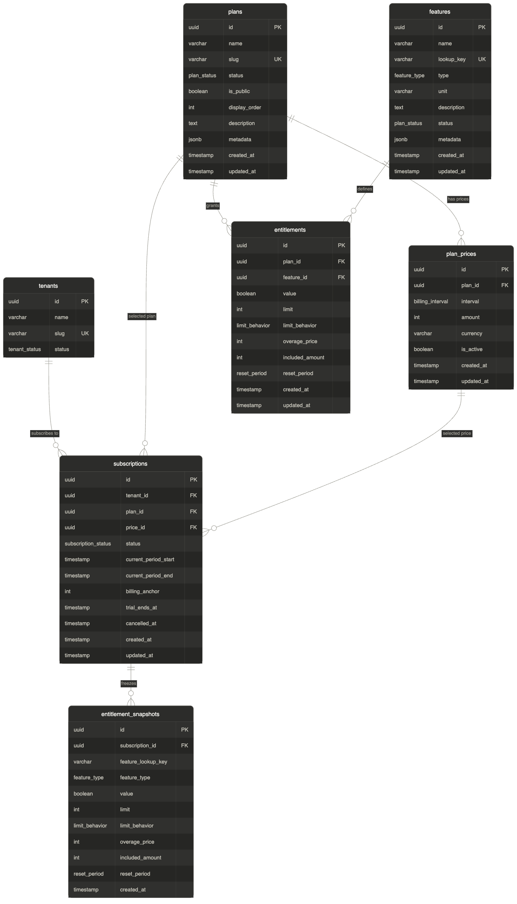

# Phase 2 - Plans, Features, Entitlements, and Subscriptions

**Goal:** Decide what a customer is allowed to do. Define plans, map features to plans with access rules, subscribe tenants, and check entitlements at runtime.

**Status:** ✅ Complete

## TLDR

Phase 2 is complete. Here's what you built:

- Plans with multi-interval, multi-currency pricing (Stripe Product/Price pattern)
- Feature catalog with three types: BOOLEAN, QUOTA, METERED
- Entitlement bridge with per-type field validation and HARD/SOFT limit enforcement
- Subscriptions that snapshot entitlements at subscribe time (existing subscribers protected from plan changes)
- Runtime entitlement check + consume endpoints - the hot path that gates every API request
- Seed data: 3 plans, 6 prices, 8 features, 24 entitlements, 3 tenant subscriptions

## What was built

### Data model



Six new tables added to the Phase 1 schema:

- **plans** - what you sell ("Starter", "Pro", "Enterprise"). Status, slug, display order, metadata. No pricing.
- **plan_prices** - pricing per plan, per interval, per currency. Multiple prices per plan. Amount in smallest currency unit (cents).
- **features** - global catalog of capabilities. lookup_key for stable code references, type (BOOLEAN/QUOTA/METERED), unit.
- **entitlements** - bridge between Plan and Feature. Defines value, limit, behavior, overage price, included amount, reset period. Fields flex by feature type.
- **subscriptions** - tenant binding to plan + price. One active subscription per tenant. Status, billing period, billing anchor, trial, cancellation timestamp.
- **entitlement_snapshots** - frozen copy of entitlements at subscribe time. Denormalizes feature_lookup_key and feature_type for fast lookup on the hot path.

See [Plans and Entitlements architecture](../architecture/phase-2-plans-and-entitlements.md) for the full schema, design decisions, and entitlement check flow.

### Pricing model

The Stripe Product/Price separation pattern:

- **Plan** = product identity ("Pro"). Immutable name and slug.
- **PlanPrice** = how much it costs ($99/mo, $948/yr, €89/mo). Multiple prices per plan, archivable.

Changing pricing means archiving the old price and creating a new one. The plan stays unchanged, existing subscribers keep their old price until renewal.

Amount is stored in the smallest currency unit as an integer:

- $99.00 = 9900 cents
- €89.50 = 8950 cents

This avoids floating-point rounding errors in billing math.

### Feature types

| Type | Gating | Example |
|------|--------|---------|
| BOOLEAN | On/off | SSO, webhooks, priority support |
| QUOTA | Numeric limit per period | 50,000 API calls/month, 10 team seats |
| METERED | Usage-based billing | Storage at $0.02/GB, tokens at $0.001/call |

### Entitlement field rules

Entitlement fields are validated against the feature type at create and update time:

- **BOOLEAN** → `value` required. `limit`, `overagePrice`, `includedAmount` rejected.
- **QUOTA** → `limit` and `resetPeriod` required. `value` and `includedAmount` rejected. `limitBehavior` defaults to HARD. `overagePrice` only valid for SOFT.
- **METERED** → `overagePrice` and `resetPeriod` required. `value`, `limit`, `limitBehavior` rejected. `includedAmount` optional.

### Limit behavior

For QUOTA features:

- **HARD** - request blocked when limit exceeded. Returns 403 "Quota exceeded".
- **SOFT** - request allowed past the limit, flagged as overage. Charged at `overagePrice` per unit.

The same feature can be HARD on Starter (block at 1,000) and SOFT on Pro (allow overage beyond 50,000, charge $0.001/call). The behavior is on the entitlement, not the feature.

### Overage pricing

Stored in micro-cents (1/10000th of currency unit) to handle sub-cent pricing:

| Real price | Micro-cents |
|-----------|-------------|
| $0.001/call | 10 |
| $0.02/GB | 200 |
| $0.50/seat | 5000 |
| $10/seat | 100000 |

Formula: `micro_cents = real_price_in_dollars × 10,000`

### Entitlement snapshots

The critical pattern: when a tenant subscribes, the plan's entitlements are frozen as snapshots on the subscription. If the plan's limits change later, existing subscribers keep their original limits until renewal.

The snapshot includes denormalized `feature_lookup_key` and `feature_type` so the entitlement check service can answer "does this tenant have access to feature X?" in a single indexed query without a JOIN to the features table.

### Subscription lifecycle

```text
TRIALING → ACTIVE → PAST_DUE → CANCELLED
                  → PAUSED → ACTIVE
                  → CANCELLED
```

One active subscription per tenant. Upgrades create a new subscription and cancel the old one - clean audit trail, every subscription is an immutable point-in-time contract.

Cancellation sets `cancelledAt` but the subscription stays ACTIVE until `currentPeriodEnd` (cancel-at-end-of-period behavior).

### Runtime entitlement evaluation

Two hot-path endpoints gate every feature usage:

**`GET /api/v1/entitlements/:featureKey/check`** - answers "can this tenant use feature X?"

Response shape varies by feature type:

- BOOLEAN: `{ allowed, type, reason }`
- QUOTA: `{ allowed, type, limit, used, remaining, resetAt, reason }`
- METERED: `{ allowed, type, includedAmount, used, overage, resetAt }`

**`POST /api/v1/entitlements/:featureKey/consume`** - increment usage counter:

- HARD quota: returns 403 if `used + amount > limit`
- SOFT quota: allows, flags as overage
- METERED: always allows, tracked for billing

Phase 2 uses in-memory counters keyed by tenant + feature + period. Phase 3 replaces this with Redis + Kafka for scale and durability.

## API endpoints

### Plans (public read, authenticated write)

| Method | Path | Description |
|--------|------|-------------|
| POST | /plans | Create a plan |
| GET | /plans | List plans (skip ARCHIVED by default) |
| GET | /plans/slug/:slug | Get plan by slug |
| GET | /plans/:id | Get plan by UUID |
| PATCH | /plans/:id | Update plan (slug immutable) |

### Plan Prices (nested under plans)

| Method | Path | Description |
|--------|------|-------------|
| POST | /plans/:planId/prices | Add a price to a plan |
| GET | /plans/:planId/prices | List prices for a plan |
| PATCH | /plans/:planId/prices/:id | Deactivate a price |

### Features (authenticated)

| Method | Path | Description |
|--------|------|-------------|
| POST | /features | Create a feature |
| GET | /features | List features |
| GET | /features/key/:lookupKey | Get feature by lookup key |
| GET | /features/:id | Get feature by UUID |
| PATCH | /features/:id | Update feature (lookup_key and type immutable) |

### Entitlements (nested under plans)

| Method | Path | Description |
|--------|------|-------------|
| POST | /plans/:planId/entitlements | Map a feature to a plan |
| GET | /plans/:planId/entitlements | List plan's entitlements |
| GET | /plans/:planId/entitlements/:id | Get entitlement details |
| PATCH | /plans/:planId/entitlements/:id | Update entitlement rules |
| DELETE | /plans/:planId/entitlements/:id | Remove feature from plan |

### Subscriptions (tenant-scoped, OWNER/ADMIN only for writes)

| Method | Path | Guards | Description |
|--------|------|--------|-------------|
| POST | /subscriptions | JWT + Tenant + OWNER/ADMIN | Subscribe to a plan |
| GET | /subscriptions/active | JWT + Tenant | Get current active subscription |
| GET | /subscriptions | JWT + Tenant | List subscription history |
| POST | /subscriptions/:id/cancel | JWT + Tenant + OWNER/ADMIN | Cancel subscription |

### Entitlement Checks (tenant-scoped)

| Method | Path | Description |
|--------|------|-------------|
| GET | /entitlements/:featureKey/check | Can this tenant use feature X? |
| POST | /entitlements/:featureKey/consume | Consume units of a feature |

## Key decisions

| Decision | Why |
|----------|-----|
| Plan/Price separation | Stripe pattern. Change pricing without recreating plans |
| Features as global catalog | Same feature, different rules per plan |
| Entitlement snapshots on subscribe | Plan changes don't break existing subscribers |
| Micro-cents for overage pricing | Avoids floating-point math for sub-cent rates |
| limit_behavior on entitlement, not feature | Same feature can be HARD on Starter, SOFT on Pro |
| lookup_key for features | Stable code-facing identifier. Code references "api_calls", not a UUID |
| Denormalized snapshots | Avoids JOIN on entitlement check (the hot path) |
| One active subscription per tenant | Clean audit trail. Upgrades cancel old, create new |
| billing_anchor capped at 28 | Avoids February edge case |
| Separate EntitlementCheck module | Admin CRUD vs runtime checks have different access patterns |
| In-memory usage counters (Phase 2) | Phase 3 replaces with Redis + Kafka for scale |

## Seed data

Three plans with tiered features. All passwords: `DevPass123`.

| Feature | Starter ($29/mo) | Pro ($99/mo) | Enterprise ($499/mo) |
|---------|------------------|--------------|----------------------|
| API Access | ✅ | ✅ | ✅ |
| API Calls | 1,000/mo HARD | 50,000/mo SOFT ($0.001) | 500,000/mo SOFT ($0.0005) |
| Storage | 1 GB + $0.05/GB | 10 GB + $0.02/GB | 100 GB + $0.01/GB |
| SSO | ❌ | ❌ | ✅ |
| Webhooks | ❌ | ✅ | ✅ |
| Priority Support | ❌ | ❌ | ✅ |
| Team Seats | 3 HARD | 10 SOFT ($10/seat) | 50 SOFT ($8/seat) |
| Analytics Export | ❌ | ✅ | ✅ |

Dev tenant subscriptions:

- Acme Corp → Pro (monthly)
- Globex Industries → Starter (monthly)
- Stark Enterprises → Enterprise (annual)

## Gotchas encountered

1. **Snapshot mismatch on existing subscriptions** - when seed re-ran on a tenant with an existing subscription created before all entitlements existed, the old snapshots were preserved. Fix: cancel and re-subscribe to refresh snapshots from current plan definition.
2. **Resource detection in audit interceptor** - needed to add `plans`, `features`, `entitlements`, `subscriptions` to `PATH_TO_RESOURCE` map, otherwise audit logs would record resource names as the raw URL segment instead of normalized names.
3. **Route ordering for `/subscriptions/active`** - must be defined before `/:id` route or NestJS interprets "active" as a UUID parameter.
4. **Field validation per feature type** - without validating that BOOLEAN entitlements only accept `value` (and reject `limit`/`overagePrice`/`includedAmount`), the database would happily store nonsensical combinations. Per-type validation is essential.
5. **Timezone handling on resetAt** - quota reset dates use local server time then serialize as UTC. Production needs explicit UTC boundaries to avoid month-end edge cases.
6. **Race condition on HARD limit consume** - two concurrent consume calls at `used=9` both pass the `9 < 10` check and both succeed. Acceptable for Phase 2 dev; Phase 3 addresses with Redis atomic operations.

## Limitations carried into next phases

- **In-memory usage counters** reset on server restart. Phase 3 → Redis.
- **No race condition protection** on HARD limit. Phase 3 → atomic Redis ops.
- **SOFT quota overage tracked but not billed**. Phase 4 → invoice generation from overage.
- **No platform admin role** - currently any authenticated user can create/modify global plans and features. Marked as TODO; will add `isPlatformAdmin` on User in a later phase.
